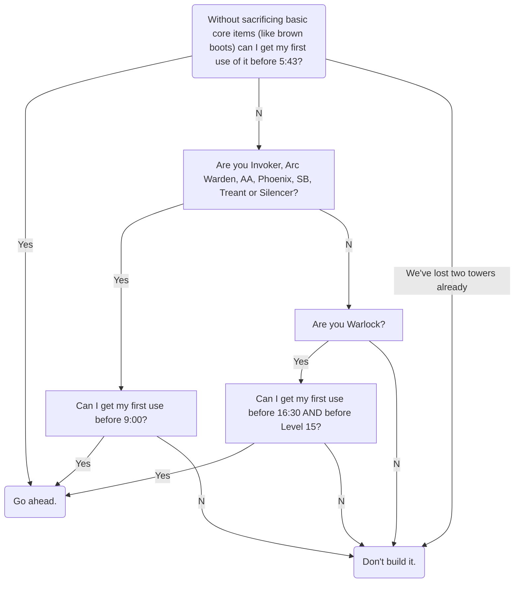
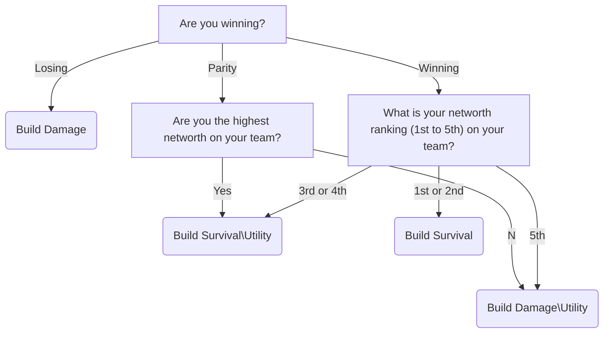
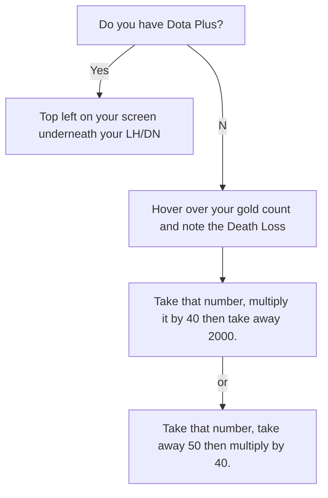

# How to win games of Dota in flowcharts.

## Simple 'win the game' tactics:
 

Should I build Hand of Midas?

What items should I build after core items?

How do I calculate my Net Worth?

> Written with [StackEdit](https://stackedit.io/).
