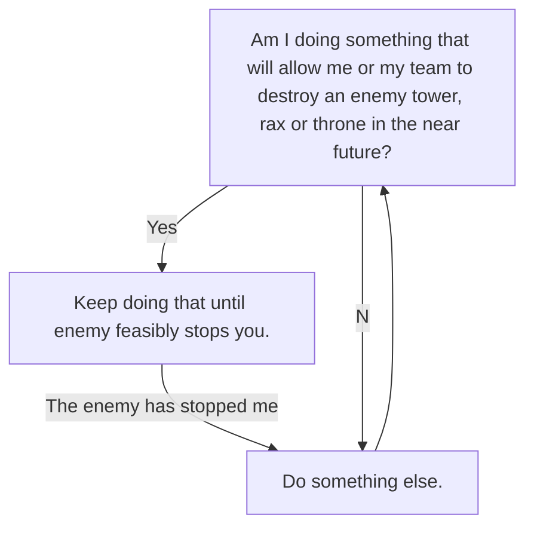
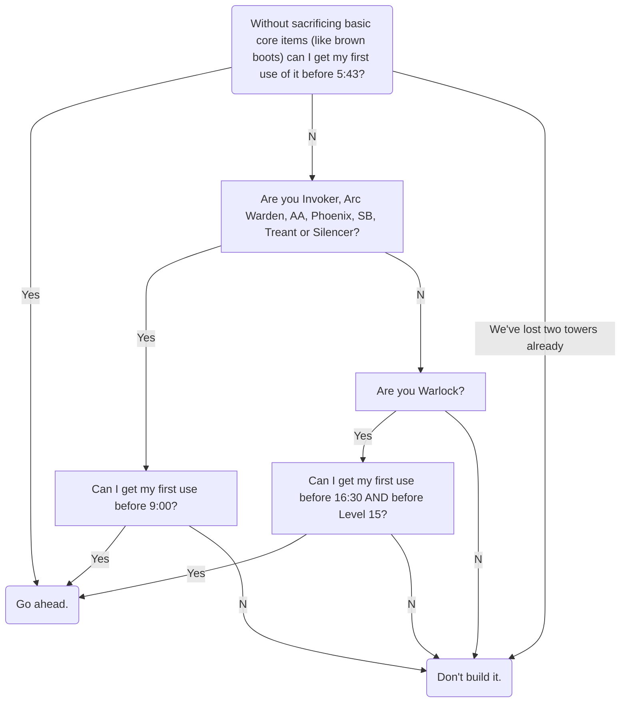
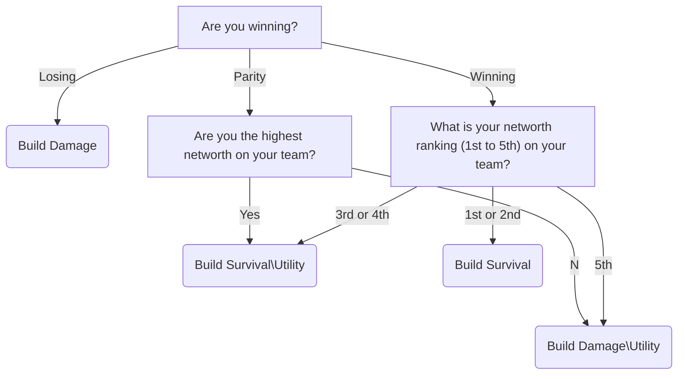
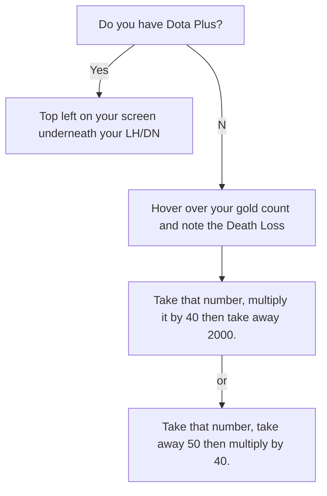

# How to win games of Dota in flowcharts.

## Simple 'win the game' tactics:
![alttext][https://mermaidjs.github.io/mermaid-live-editor/#/view/eyJjb2RlIjoiZ3JhcGggVEQ7XG5BW0FtIEkgZG9pbmcgc29tZXRoaW5nIHRoYXQgd2lsbCBhbGxvdyBtZSBvciBteSB0ZWFtIHRvIGRlc3Ryb3kgYW4gZW5lbXkgdG93ZXIsIHJheCBvciB0aHJvbmUgaW4gdGhlIG5lYXIgZnV0dXJlP11cbkEtLVllcy0tPkJbS2VlcCBkb2luZyB0aGF0IHVudGlsIGVuZW15IGZlYXNpYmx5IHN0b3BzIHlvdS5dXG5CLS1UaGUgZW5lbXkgaGFzIHN0b3BwZWQgbWUtLT5DXG5BLS1Oby0tPkNbRG8gc29tZXRoaW5nIGVsc2UuXVxuQy0tPkFcbiIsIm1lcm1haWQiOnsidGhlbWUiOiJkZWZhdWx0In19]

Should I build Hand of Midas?

What items should I build after core items?

How do I calculate my Net Worth?

> Written with [StackEdit](https://stackedit.io/).
